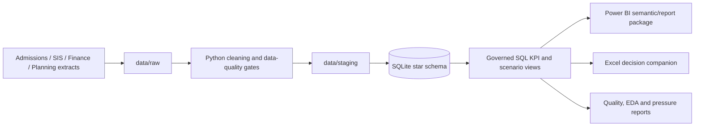
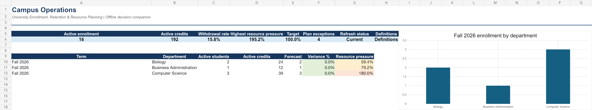
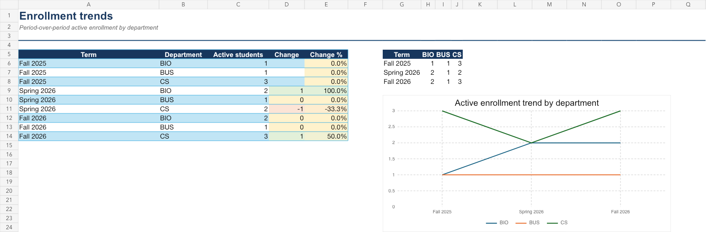
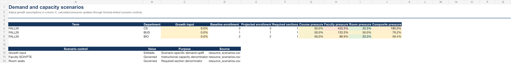

# campus-ops

University Enrollment, Retention & Resource Planning BI is a reproducible decision-support portfolio project. It models the path from governed university operations data to validated KPIs, scenario-based capacity planning, and executive decision products.

> The checked-in dataset is synthetic and de-identified. It exists to make the project reproducible and must not be interpreted as institutional performance.

## Problem and stakeholders

Enrollment, retention, scheduling, and finance information often sit in separate systems with inconsistent definitions and delayed reporting. `campus-ops` provides a governed view of enrollment, persistence signals, instructional capacity, and planning risk.

| Stakeholder | Decisions supported |
| --- | --- |
| Registrar | Census reconciliation, section capacity, registration/withdrawal follow-up |
| Dean | Program demand, retention interventions, faculty-resource prioritization |
| Finance | Enrollment/tuition plan variance and scenario assumptions |
| Department Head | Course sections, faculty workload, room pressure, and local exceptions |

## Dataset provenance and security

The sample contains synthetic CRM/SIS/ERP-style extracts for terms, organizations, pseudonymized students, enrollment, sections, financial plans, and resource scenarios. All sources are documented in [the data pipeline guide](docs/data_pipeline.md). The production design requires approved secure ingestion; no FERPA-regulated records, direct identifiers, credentials, or confidential financial extracts may be committed.

## Architecture and schema



The model uses conformed `dim_term`, `dim_academic_org`, and `dim_student` dimensions with enrollment, course-section, planning, resource-scenario, and resource-pressure facts. Exact grain and keys are documented in [the data dictionary](docs/data_dictionary.md).

## KPIs and controls

Core measures include applications, admit/yield rate, census enrollment, credit hours, course fill rate, retention/persistence, completion, net tuition, enrollment forecast variance, and instructional capacity gap. See [the KPI catalog](docs/kpi_catalog.md).

Automated quality gates check required schema, null thresholds, duplicates, dates/categories/ranges, referential integrity, freshness, row retention, and source-to-curated-to-reporting reconciliation. The latest generated [data-quality report](reports/data_quality.md) records the evidence.

## Decision products

- [Power BI source-controlled package](powerbi/README.md): Date table, DAX measures, semantic-model wiring, six-page report design, drill-through, tooltips, KPI targets, and conditional formatting.
- [Excel companion](excel/CampusOps_Decision_Companion.xlsx): executive KPIs, trends, formula-driven scenario controls, exceptions, quality controls, definitions, and Power Query instructions.
- [Resource-pressure output](reports/resource_pressure.md): ranked course/faculty/room demand-capacity scenarios.

### Dashboard screenshots

| Executive overview | Trend analysis | Scenario controls |
| --- | --- | --- |
|  |  |  |

## Techniques demonstrated

- Python standard-library ingestion, type/category normalization, SHA-256 pseudonymization, SQLite loading, quality reports, and unit tests.
- SQL CTEs, window functions (`LAG`, `DENSE_RANK`), KPI views, exception tables, source/curated/reporting reconciliation, and scenario-pressure calculations.
- Pandas/NumPy/Matplotlib EDA for distributions, outliers, missingness, correlations, and drivers.
- Power BI DAX Date table/measures and an Excel model with `INDEX`/`MATCH`, validations, conditional formatting, native charts, and governed scenario inputs.

## Reproduce from a fresh clone

```bash
git clone https://github.com/xvipull/campus-ops.git
cd campus-ops
python3 src/run_pipeline.py
python3 -m unittest discover -s tests -v

# Optional EDA figures (pandas, numpy and matplotlib required)
python3 -m pip install -r requirements.txt
python3 notebooks/eda.py
```

Equivalent shortcuts: `make build`, `make test`, and `make release-check`.

The first command rebuilds `data/staging/`, `data/campus_ops.db`, `reports/data_quality.md`, and `reports/resource_pressure.md`. For Power BI/Excel refresh, configure an approved SQLite ODBC DSN named `CampusOpsSQLite` and follow the package READMEs.

## Portfolio impact statements

- Built a reproducible university BI pipeline that preserves raw data, applies seven data-quality control categories, and reconciles source, curated, and reporting totals.
- Designed a dimensional analytics model and SQL KPI layer with window functions, exceptions, cohort logic, and ranked demand-capacity scenarios for course, faculty, and room planning.
- Delivered governed Power BI and Excel decision-product assets with KPI targets, quality visibility, drill-through specifications, and refresh-ready connection definitions.

## Release documentation

- [Project charter and requirements](docs/requirements.md)
- [UAT cases and expected results](docs/uat.md)
- [Architecture and data flow](docs/architecture.md)
- [Business insights and recommendations](docs/business_insights.md)
- [Demo script](docs/demo_script.md)
- [Release validation evidence](docs/release_validation.md)
- [Assumptions and limitations](docs/assumptions.md)
