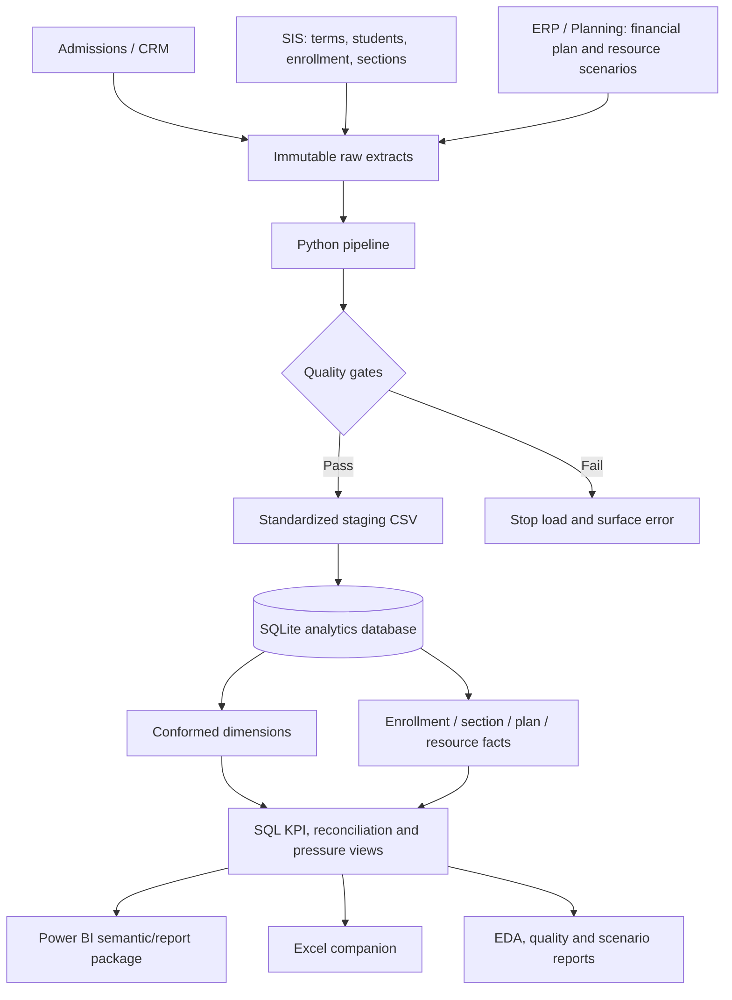

# Architecture and Data Flow

## Release flow

1. Raw synthetic extracts remain preserved in `data/raw`.
2. `src/run_pipeline.py` standardizes types, business keys, dates, currency, and categories; invalid data stops the load.
3. Clean tables load to the dimensional SQLite model. Surrogate keys are generated in dimensions; business keys remain unique and traceable.
4. SQL materializes KPI/exception/decision-support layers and reconciliation controls compare source, curated, and reporting totals.
5. Power BI and Excel consume governed views/tables via an approved SQLite ODBC connection in production.

The model is batch-based: daily operational data, term census certification, weekly planning capacity, and monthly finance close follow the cadence in [requirements.md](requirements.md).
